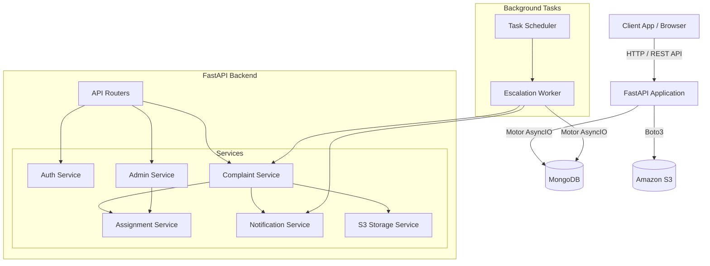
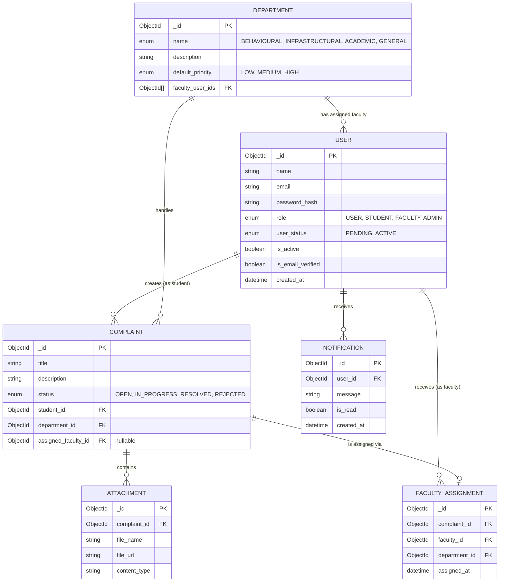

# ResolveNow Backend

The ResolveNow Backend is a FastAPI-based service designed to handle complaints and grievances. It features automated assignment of complaints to faculty members, status tracking, and notification systems.

## Design & Architecture

### Application Architecture
This diagram outlines the high-level components of the backend, request flow, and interactions with external services like MongoDB and Amazon S3.



### Entity-Relationship (ER) Diagram
This diagram represents the logical relationships and references between the primary entities and collections in the MongoDB database.



## Setup & Installation

1.  **Clone the repository.**
2.  **Create a virtual environment:**
    ```bash
    python -m venv venv
    source venv/bin/activate  # On Windows: venv\Scripts\activate
    ```
3.  **Install dependencies:**
    ```bash
    pip install -r requirements.txt
    ```
4.  **Configure environment variables:** Create a `.env` file based on the provided configuration.
5.  **Run the application:**
    ```bash
    python -m app.main
    ```
