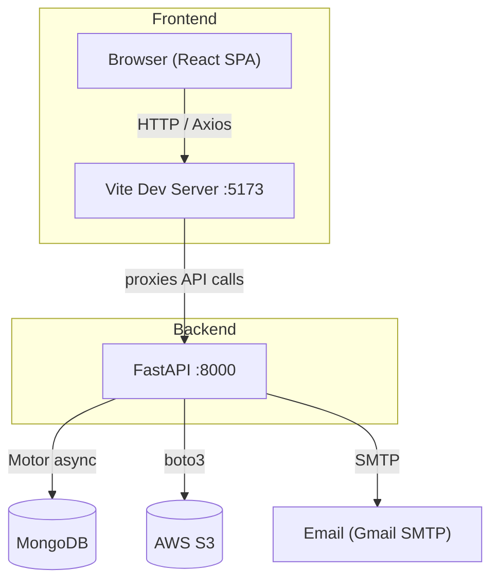
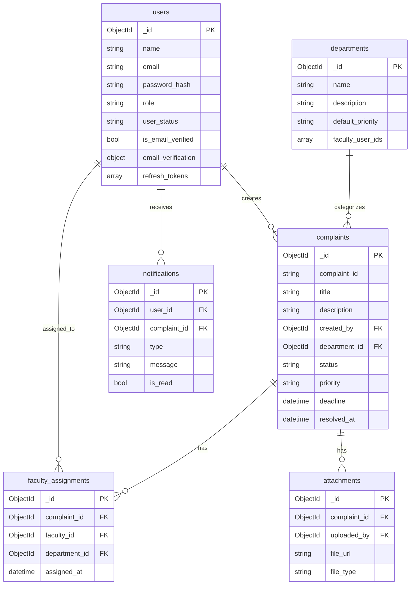
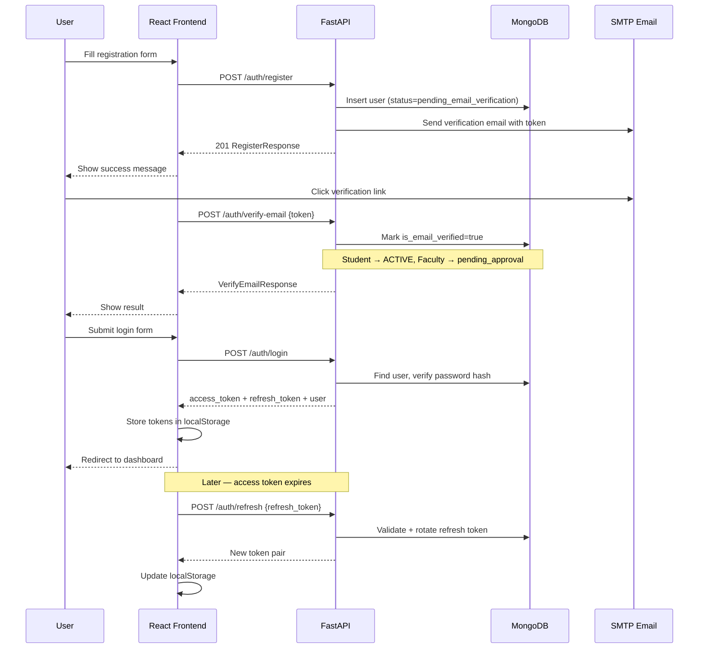
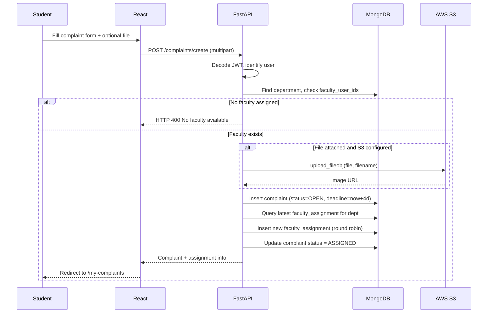
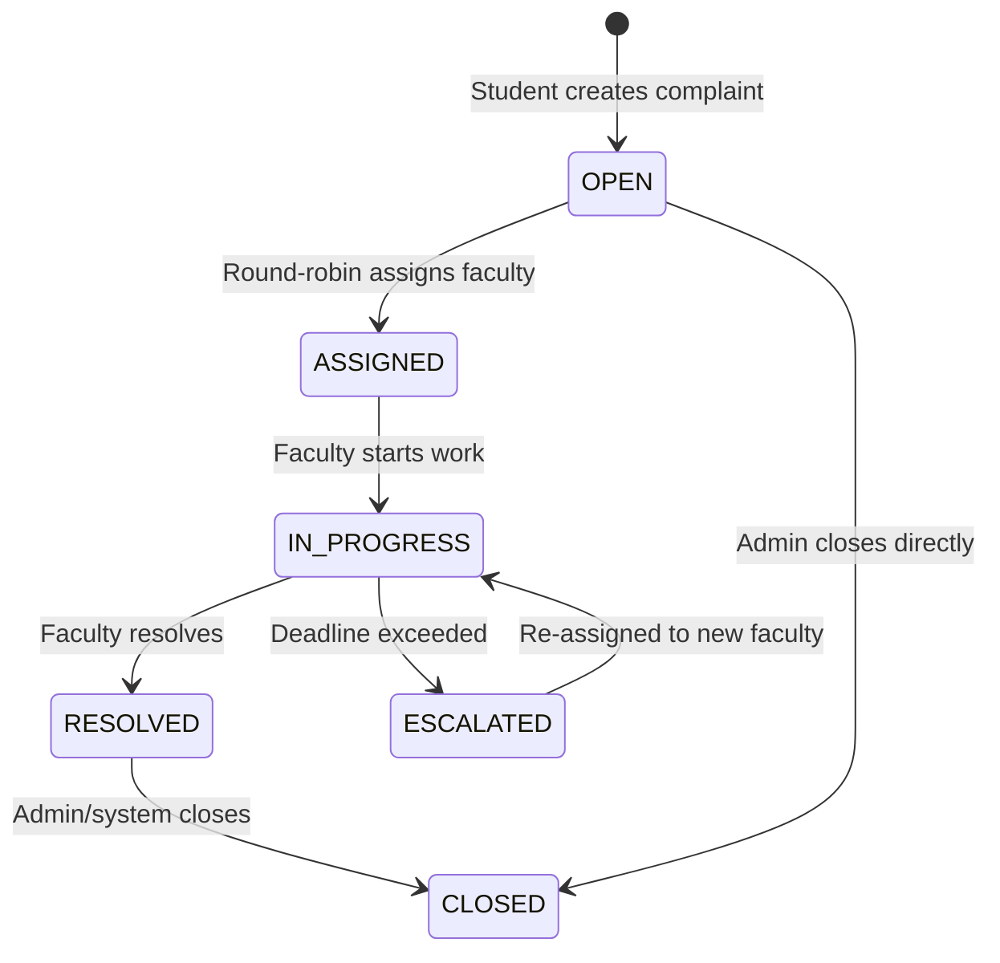
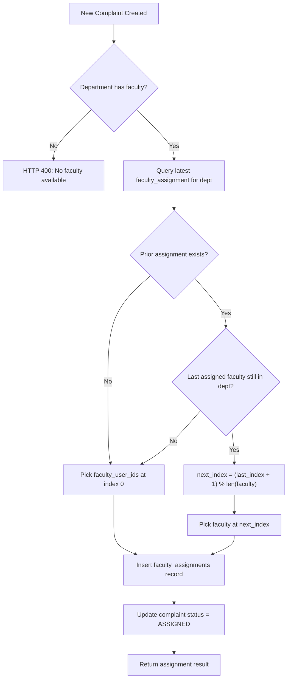
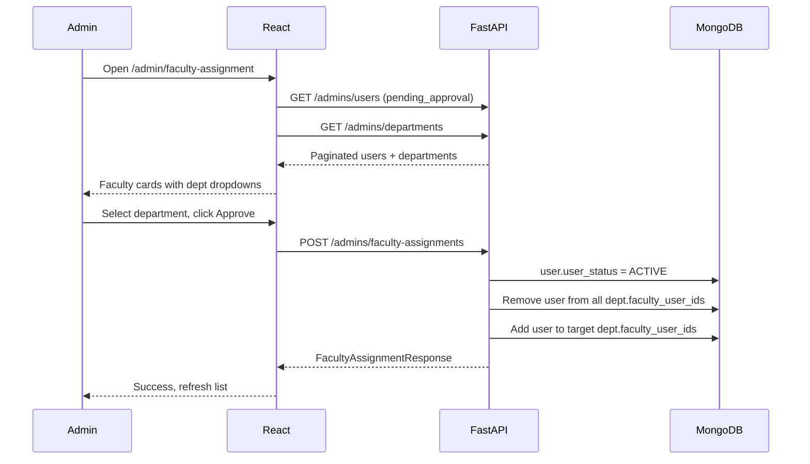
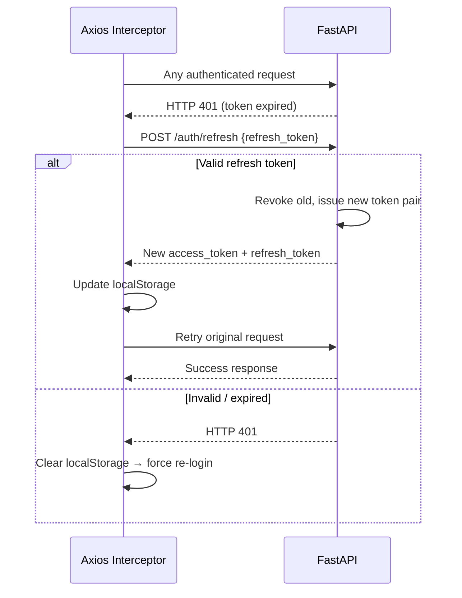
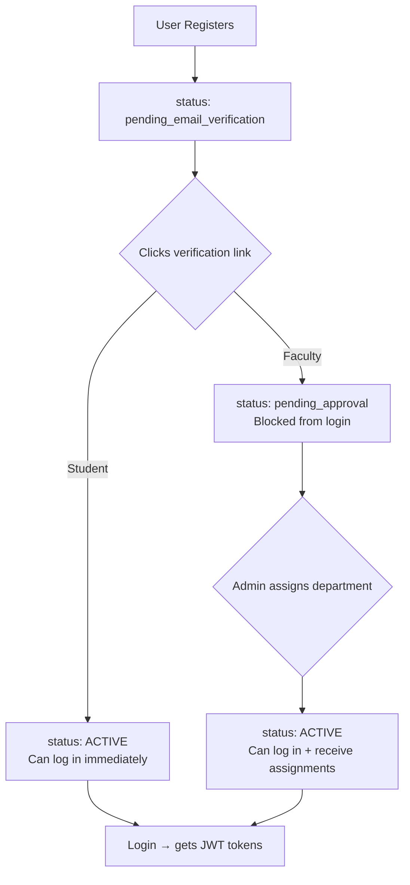
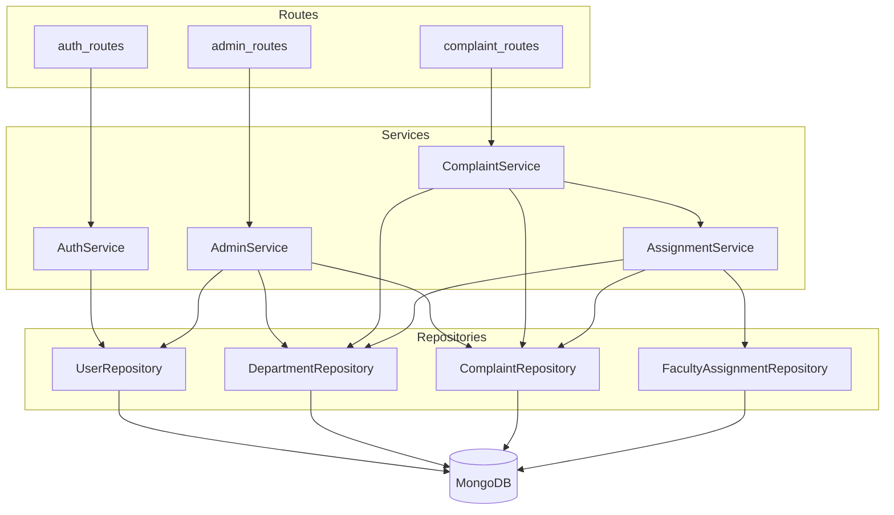

Here are all the Mermaid diagrams — paste any into [mermaid.live](https://mermaid.live) to render.

---

**1. System Architecture**

---

**2. Database ER Diagram**

---

**3. Registration & Login Sequence**

---

**4. Complaint Creation Sequence**

---

**5. Complaint Status State Machine**

---

**6. Round Robin Assignment Flowchart**

---

**7. Admin Faculty Approval Flow**

---

**8. JWT Token Refresh Interceptor**

---

**9. User Role & Status Lifecycle**

---

**10. Full Backend Layer Diagram**

